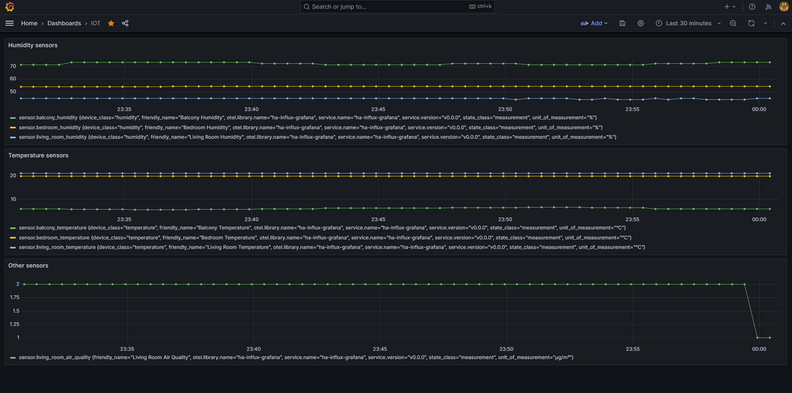
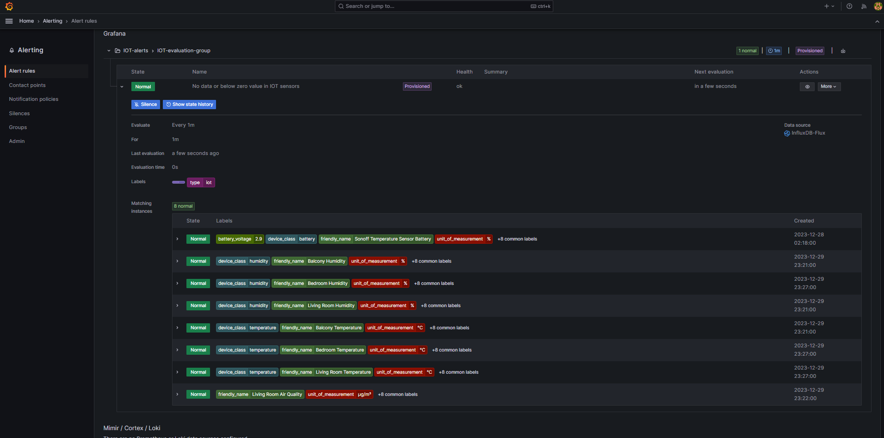

## ha-influx-grafana

## TL;DR

This is an app that fetches temperature/humidity/air quality sensor states from Home Assistant and make it available in Grafana.

## What this does

This is mainly a Go app that:
- Fetch sensor states from Home Assistant [using their API](https://developers.home-assistant.io/docs/api/rest/)
- Create metrics using the OTEL SDK with the state of these sensors
- Pushes the metrics to OTEL Collector
- In OTEL Collector the metrics are pushed to InfluxDB, a timeseries database
- The data in InfluxDB can be seen in Grafana
- In Grafana:
  - There is a dashboard for showing the metrics grouped by the device class attribute from Home Assistant (it can be humidity or temperature, for example)
  - There are also alerts that will trigger in case one of the sensors is not flowing metrics in the last minute. The alerts will be sent to the configured contact points

## Running

To run this:

1. Create an `.env` file like this.
This will be used by the Go app that will flow metrics to Grafana.
```
# Home Assistant API URL. 
# For example, http://localhost:8123/api/states
HA_URL=<value>

# Home Assistant authentication token. 
# For more details please go to https://www.home-assistant.io/docs/authentication/
HA_TOKEN=<value>

# OTEL Collector URL. 
# For example, localhost:4318
OTEL_COLLECTOR_URL=<value>
```

2. Create an `.env.grafana` file like this:
```
# Grafana SMTP host + port + credentials for sending email alerts
GF_SMTP_HOST_AND_PORT=<value>
GF_SMTP_USER=<value>
GF_SMTP_PASSWORD=<value>

# Grafana SMTP 'from' address and name in email
GF_SMTP_FROM_ADDRESS=<value>
GF_SMTP_FROM_NAME=<value>

# Grafana email alert targets.
# Can be separated by comma
GF_CONTACT_POINTS_EMAIL_ADDRESSES=<value>
```

3. Run Docker Compose
```shell
docker compose up --build
```

If everything goes well this is the dashboard you will see in Grafana:



And the alert:

